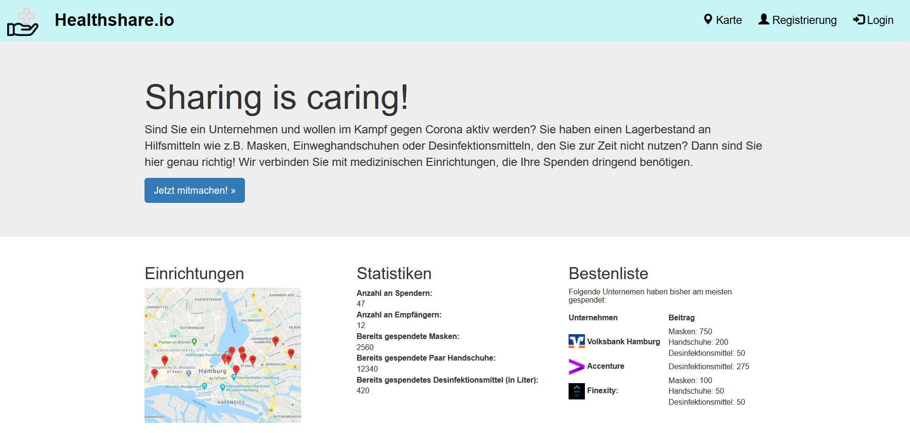

# Healthshare - Sharing is caring!

This web app propotype was built during the #WirVsVirus hackathon that took place online from the 20th of March to the 22nd of March 2020.

## Idea

Due to the corona crisis, medical institutions struggle to have the required amounts of medical equipment in stock to effectively fascilitate their patients needs.

Via our web app, companies gain insight in the current market demand, understand who in the region is in need of equipment and can liquidiate their stock of e.g. disinfectant, gloves and masks and share them with local medicial institutions.

Healthshare allows companies to sign up on our website, choose a medical institution they want to support, choose how much equipment they want to donate and allows them to track their donation.



## Architecture

The protoype is built with Bootstrap, runs on Flask and persists data in a MySQL database. The map is provided by the Google Maps Platform. Containerization using Docker is possible.

## Run

### Run in Flask

Requirements:
- Python 3.X
- pip (install flask, mysql-connector, flask_cors, requests)
```
python app.py
``` 
The web app is accesible via `localhost:5000`.

### Run in Docker (in development)

Requirements:
- Docker

```
docker build -t healthshare:latest .
```
```
docker run -p 5000:5000 healthshare
```
The web app is accesible via `localhost:5000`.

## License

Open-source. However, we used company logos that might be subject to copyright and make use of the Google Maps Platform. The map screenshot is under copyright of Google LLC.

The companies behind the logos were and are not involved in the development of this prototype.